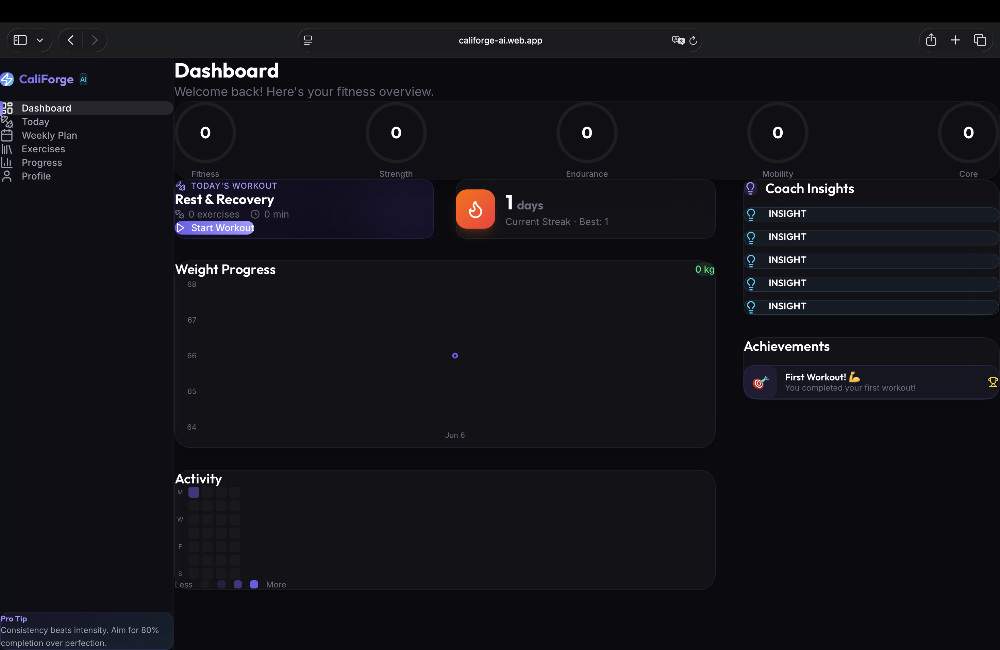
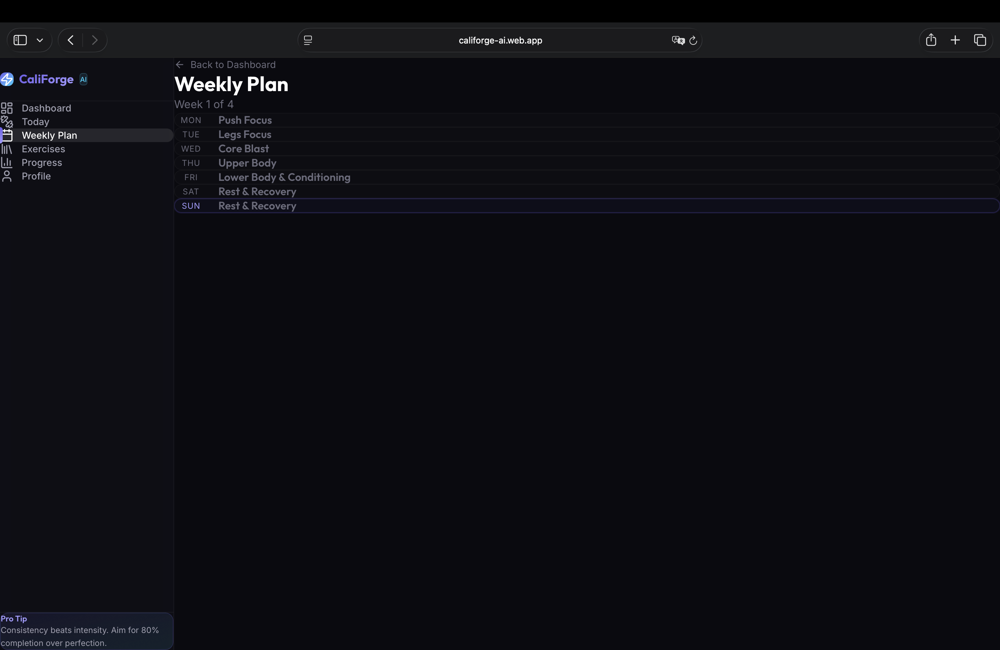
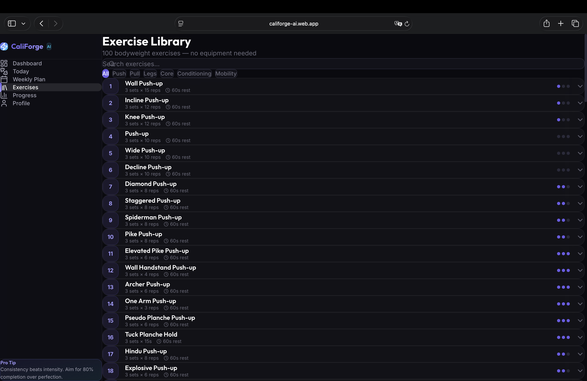
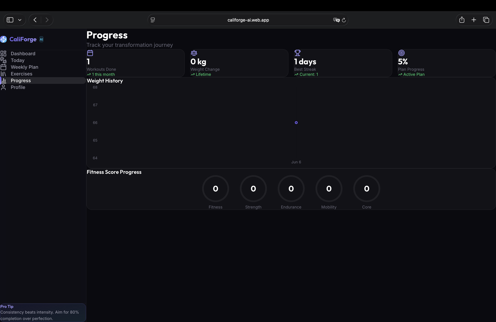
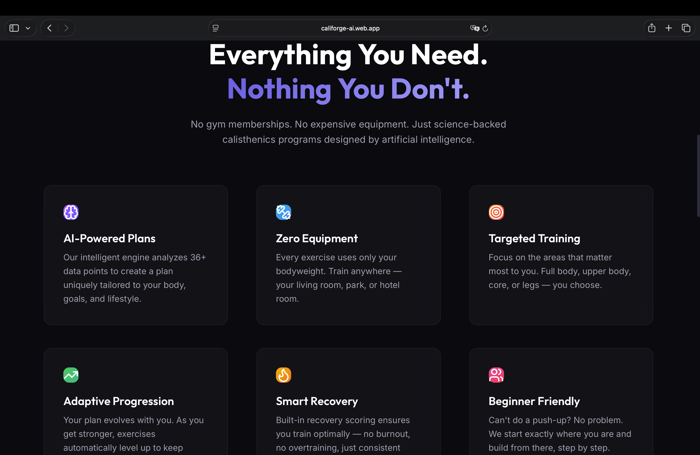
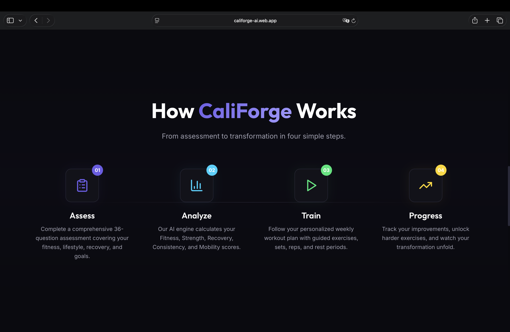

<div align="center">
  
  <h1>CaliForge AI ⚡️</h1>
  <p><strong>Your Intelligent Calisthenics & Fitness Companion</strong></p>
  <a href="https://califorge-ai.web.app"><strong>View Live Demo »</strong></a>
  <br />
  <br />
</div>

## 🏋️‍♂️ Overview

CaliForge AI is a full-stack, AI-powered workout generator and fitness tracking platform. By taking a dynamic assessment of a user's goals, body type, and fitness level, CaliForge generates highly personalized, mathematically scaled weekly workout plans using a proprietary Python-based AI progression engine. 

## ✨ Key Features

- **🧠 AI Workout Generator:** Dynamically creates weekly splits (Push/Pull/Legs/Core) based on user goals (Muscle Gain, Weight Loss, Strength).
- **📈 Progression Engine:** Automatically scales repetitions and sets using progressive overload algorithms.
- **📚 Massive Exercise Library:** Contains 100+ scientifically backed exercises categorized by focus area and difficulty.
- **📊 Interactive Dashboard:** Track your consistency streaks, view completion radars, and log your weight over time.
- **🔐 Secure Authentication:** Full user lifecycle management powered by Firebase Auth.

## 📸 Gallery

<p float="left">
  
  
  
  
  
  
  
</p>

## 💻 Tech Stack

### Frontend (Firebase Hosting)
- **React 18** with **Vite** for lightning-fast bundling.
- **Tailwind CSS** for modern, responsive, and glassmorphism styling.
- **Zustand** for lightweight global state management.
- **Framer Motion** for micro-animations and smooth transitions.
- **Firebase Auth** for secure user login and registration.

### Backend (Render)
- **Python 3.12** & **FastAPI** for high-performance API endpoints.
- **Motor (Async PyMongo)** for non-blocking database queries.
- **Pydantic** for rigorous data validation and typing.

### Database (MongoDB Atlas)
- **MongoDB** hosted on Atlas, serving as the single source of truth for users, workouts, and the massive exercise library.

## 🚀 Running Locally

If you want to run the project locally, follow these steps:

### 1. Clone the Repository
```bash
git clone https://github.com/yusufamjhera-code/califorge-ai.git
cd califorge-ai
```

### 2. Setup Dependencies
Before running the scripts, ensure you have installed the required dependencies:
```bash
# Backend
cd backend
python -m venv venv
source venv/bin/activate  # On Windows use `venv\Scripts\activate`
pip install -r requirements.txt
cd ..

# Frontend
cd frontend
npm install
cd ..
```

### 3. Launch the App!
We have provided convenient launcher scripts that will automatically start both the backend server and frontend development environment at the same time:

- **Windows:** Double click `start.bat`
- **Linux / Mac:** Run `./start.sh` in the terminal
- **Mac (Automator):** Double click `Start CaliForge.app`

---
<div align="center">
  <i>Built with ❤️ by Yusuf</i>
</div>
